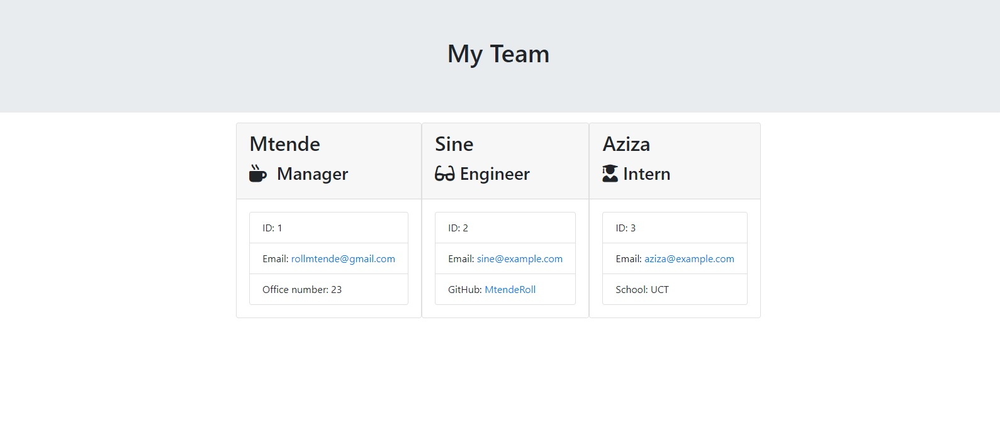
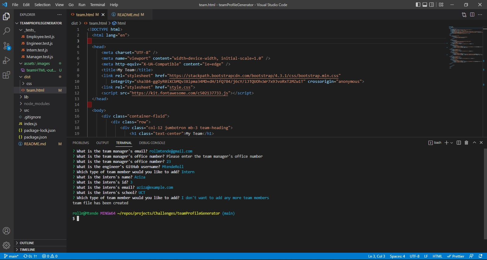

# Team Profile Generator

Node.js command-line application that takes in information about employees on a software engineering team and generates an HTML webpage that displays summaries for each person.

This application makes it possible for a manager to generate a webpage that displays their teams basic information so that they have quick access to their emails and Github profiles.

## Table of Contents

- [Installation](#installation)
- [Tests](#tests)
- [Links](#links)
- [Mock-ups](#mock-ups)
- [Walkthrough Video](#walkthrough-video)

## Installation

run this in your command line

```
npm install
```

## Tests

This application is using Jest to run the tests

## Links

- [Github Repo](https://github.com/MtendeRoll/teamProfileGenerator)
- [Live Page](https://mtenderoll.github.io/teamProfileGenerator/)

## Mock-ups

Generated HTML



Question Prompts Example



## Walkthrough Video

[Explanation Video](https://drive.google.com/file/d/1-tbZWpMbygK7GE8-UTeU8SxYsLTBYAl3/view)
